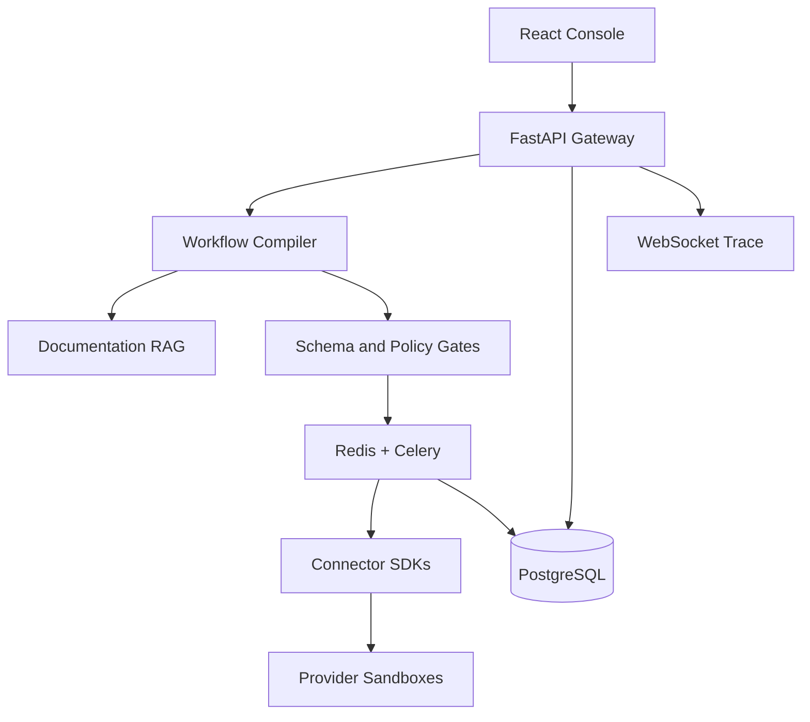

# IntegrateX

### Evidence-backed API integration and workflow reliability platform

[](https://aahanaahir22.github.io/integratex/)
[](https://github.com/aahanaahir22/integratex/actions/workflows/ci.yml)
[](https://github.com/aahanaahir22/integratex/actions/workflows/pages.yml)
[](LICENSE)

**[Launch the live interactive demo →](https://aahanaahir22.github.io/integratex/)**  
No account, API key or backend is required for the hosted product tour. The complete FastAPI execution platform runs locally through Docker.

IntegrateX converts natural-language business requirements into typed, versioned and recoverable API workflows. It retrieves version-bound connector documentation, attaches evidence to generated operations, validates schemas and risk policies, and executes through a durable worker architecture with approval gates, retries, idempotency and complete traces.

> **Engineering rule:** AI proposes. Deterministic code validates and executes.

## Why it exists

Business integrations often fail for reasons that simple workflow builders hide: expired scopes, API contract changes, duplicate webhooks, rate limits, uncertain timeouts and partial completion. IntegrateX makes those failure conditions visible and testable.

This is not positioned as a marketplace of hundreds of shallow connectors. It is a focused integration-reliability platform that demonstrates how a small set of connectors can be executed safely and explained precisely.

## Flagship workflow

```text
When a Stripe test payment succeeds:
  verify the webhook signature
  normalize the customer payload
  request approval before updating an existing HubSpot contact
  persist the order using an idempotency key
  notify the sales team in Slack
  recover from temporary provider failures without duplicate side effects
```

The resulting workflow follows:

```text
Trigger → Validate → Transform → Guard → Execute → Verify → Record
```

## Product surfaces

- **Mission Control** — animated operational overview and live execution trace
- **Compiler Studio** — natural-language intent to evidence-backed workflow DAG
- **Failure Lab** — controlled 429, timeout, schema-drift and duplicate-webhook injection
- **Connector Mesh** — versioned connector passports, scopes and contract health
- **Evidence Vault** — documentation chunks, versions, hashes and grounding reasons
- **Reliability Signals** — outcomes, recovery, latency and contract-quality views
- **Guard Rail** — human approval queue with a proposed record diff and audit decision

## What is implemented

### Frontend

- React 19 + TypeScript + Vite
- Framer Motion page, state and micro-interactions
- Interactive XYFlow workflow graph
- Responsive layout and reduced-motion mode
- Animated compiler, execution trace and failure-recovery sequences
- Safe local fallback data so the experience remains demonstrable if the API is offline

### Backend

- FastAPI with generated OpenAPI documentation
- Pydantic-validated workflow plans and API models
- Deterministic documentation retrieval with evidence IDs and version metadata
- Typed workflow DAG compiler
- PostgreSQL-ready SQLAlchemy persistence with SQLite fallback
- Celery + Redis worker execution seam
- Bounded retry and idempotency requirements for connector tasks
- Synthetic resilience scenarios
- Approval endpoints and immutable audit events
- WebSocket execution stream
- Security headers and role-gated approval decisions
- Optional OpenAI interpretation adapter that cannot alter execution authority

### Delivery

- Docker Compose with React, FastAPI, PostgreSQL, Redis and Celery
- GitHub Actions frontend/backend CI
- Architecture, threat-model, evaluation and recruiter-demo documentation
- AWS deployment target for ECS Fargate, RDS, ElastiCache, S3/CloudFront, KMS and Secrets Manager

## Architecture



Read [the architecture notes](docs/ARCHITECTURE.md) for trust boundaries and execution semantics.

## Quick start with Docker

Requirements: Docker Desktop with Docker Compose.

```bash
git clone https://github.com/aahanaahir22/integratex.git
cd integratex
docker compose up --build
```

Open:

- Product console: `http://localhost:5173`
- FastAPI documentation: `http://localhost:8000/docs`
- Health endpoint: `http://localhost:8000/health`

## Local development

### Backend

```bash
cd backend
python -m venv .venv
source .venv/bin/activate
pip install -r requirements.txt
uvicorn app.main:app --reload --port 8000
```

The API uses `sqlite:///./integratex.db` when `DATABASE_URL` is absent.

### Frontend

```bash
cd frontend
npm install
npm run dev
```

Vite proxies API requests to `http://localhost:8000`.

## Optional LLM interpretation

The complete public demonstration works without an API key. To enable provider-backed interpretation:

```bash
cd backend
pip install -r requirements-ai.txt
export INTEGRATEX_USE_LLM=true
export OPENAI_API_KEY=<your-key>
export OPENAI_MODEL=gpt-5-mini
```

The model is restricted to explanatory metadata. It cannot create executable connector operations directly. Nodes, scopes, retries, idempotency and approval policies remain deterministic.

## Core API

| Method | Endpoint | Purpose |
|---|---|---|
| `POST` | `/api/v1/workflows/compile` | Compile intent into a grounded typed plan |
| `POST` | `/api/v1/executions` | Create a guarded execution trace |
| `GET` | `/api/v1/executions/{id}` | Inspect a persisted execution |
| `GET` | `/api/v1/workflows/{id}` | Read an immutable compiled plan |
| `POST` | `/api/v1/failure-lab/scenarios` | Run a synthetic resilience scenario |
| `GET` | `/api/v1/connectors` | List connector passports |
| `GET` | `/api/v1/evidence` | Inspect versioned evidence |
| `GET` | `/api/v1/metrics` | Read dashboard metrics |
| `GET` | `/api/v1/approvals` | List guarded actions |
| `POST` | `/api/v1/approvals/{id}/approve` | Record an approval |
| `POST` | `/api/v1/approvals/{id}/reject` | Record a rejection |
| `GET` | `/api/v1/audit` | Read organisation-scoped audit events |
| `WS` | `/ws/executions/{id}` | Stream a step-level trace |

Example:

```bash
curl -X POST http://localhost:8000/api/v1/workflows/compile \
  -H 'Content-Type: application/json' \
  -d '{
    "prompt": "When Stripe payment succeeds, update the existing HubSpot contact, save the order, and notify Slack."
  }'
```

## Reliability behaviour

| Failure | Control |
|---|---|
| HTTP 429 | Respect `Retry-After`, exponential backoff and jitter |
| Provider timeout | Verify remote state or require approval before replay |
| Duplicate webhook | Resolve the previous result using the idempotency ledger |
| Breaking schema change | Block workflow publication and show a contract diff |
| Missing OAuth scope | Reject before queueing execution |
| Permanent provider error | Isolate to a dead-letter path |
| Existing CRM mutation | Pause behind an explicit human approval |

IntegrateX deliberately claims **effectively-once business behaviour**, not impossible exactly-once distributed delivery.

## Security posture

- Production credentials are represented by secret references, not stored in workflow JSON.
- Connector hosts and operations must come from an allow-listed registry.
- Webhooks require provider signatures, replay windows and idempotency.
- Sensitive fields must be redacted from logs and traces.
- Approval actions are role-gated and written to an audit table.
- The production identity seam is OIDC/JWT with organisation-scoped queries.
- The public demo targets only synthetic endpoints and provider test modes.

See [THREAT_MODEL.md](docs/THREAT_MODEL.md).

## Testing

```bash
make test
```

The backend suite verifies:

- Health/readiness
- Grounded workflow compilation
- Approval on sensitive mutations
- Evidence attachment
- Duplicate-side-effect prevention in the failure lab
- Correct missing-evidence response

The frontend build performs strict TypeScript validation.

## Evaluation honesty

Values visible in the initial dashboard are seeded demonstration values. They are intentionally not described as verified benchmarks. Before using any number on a résumé, run the reproducible protocol in [EVALUATION.md](docs/EVALUATION.md) and publish raw results.

Recommended acceptance gates:

- At least 95% healthy workflow completion
- At least 90% recovery for injected transient failures
- Zero duplicate side effects in the test suite
- 100% detection of injected breaking contract changes
- Zero high-risk actions executed without approval
- At least 90% evidence citation precision

## Repository map

```text
integratex/
├── frontend/              React product console
├── backend/app/           FastAPI, compiler, RAG, persistence and worker
├── backend/tests/         API and resilience tests
├── docs/                  Architecture, security, evaluation and demo guide
├── infra/                 AWS deployment target
├── .github/workflows/     CI
├── docker-compose.yml     Complete local stack
└── Makefile               Common development commands
```

## Recruiter demo

Start with the [live product console](https://aahanaahir22.github.io/integratex/), then use the [90-second demo script](docs/DEMO_SCRIPT.md). It is designed to show the differentiating engineering evidence quickly:

1. Compile a real integration request.
2. Inspect documentation evidence and deterministic gates.
3. Run the workflow and reach an approval boundary.
4. Inject HTTP 429 in the Failure Lab.
5. Show bounded recovery and verified outcome.

For a structured engineering review, open the [recruiter guide](docs/RECRUITER_GUIDE.md). It maps each visible product surface to the implementation evidence behind it.

## Portfolio-ready summary

> Built IntegrateX, an AI-native API integration and workflow reliability platform that compiles natural-language requirements into versioned, evidence-backed DAGs; validates schemas, OAuth scopes and risk policies; and executes through idempotent workers with bounded retries, approval gates and traceable recovery.

**Suggested portfolio links:** [Live demo](https://aahanaahir22.github.io/integratex/) · [Source code](https://github.com/aahanaahir22/integratex) · [Architecture](docs/ARCHITECTURE.md) · [Evaluation protocol](docs/EVALUATION.md)

## Current limitations

- Connector actions are safe simulators; real provider SDKs belong behind the existing worker seam.
- The zero-key retriever is deterministic lexical retrieval; FAISS is the documented production replacement.
- Local identity headers are a demonstration seam, not a production authentication mechanism.

## Responsible claims

The hosted console uses explicit seeded demo data and safe local fallbacks. Performance numbers become résumé claims only after running the published [evaluation protocol](docs/EVALUATION.md). This keeps the project visually ambitious and technically honest.

## License and collaboration

Released under the [MIT License](LICENSE). Security reports follow [SECURITY.md](SECURITY.md), and proposed improvements follow [CONTRIBUTING.md](CONTRIBUTING.md).
- Dashboard values are seeded until the benchmark suite produces measured results.
- Workflow execution is intentionally paused at a CRM mutation to demonstrate human-in-the-loop control.

These limitations are explicit because engineering credibility is more valuable than exaggerated autonomy.

## License

MIT © 2026 Aahana Ahir
